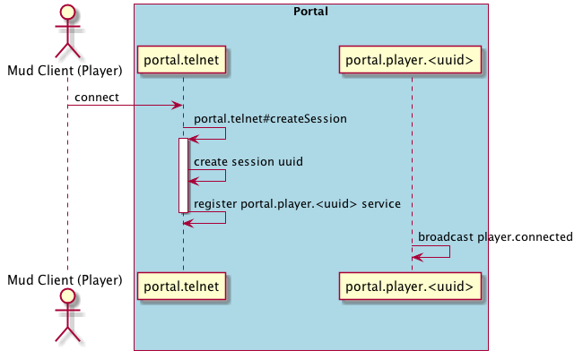

The Portal process handles the incoming connections from the player and proxies the player input to the [World](), and
the World output back to the Player. Only one Portal should be run per game instance. 

## Portal Architecture
The Portal is a [Moleculer Service Broker]() that runs a single [TelnetService]() under `portal.telnet` and dynamically 
spools up [SessionService]() instances for every connection under `portal.player.<uuid>`. These SessionService instances
are automatically destroyed when the session disconnects.

## Connection Flow

1. As soon as the initial connection is made, a UUID is created to represent the connection.
1. The TelnetService then creates a new SessionService under the name of `portal.player.<uuid>`
1. The SessionService broadcasts the 'player.connected' event with the player connection information.
