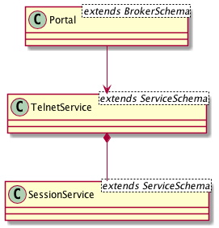
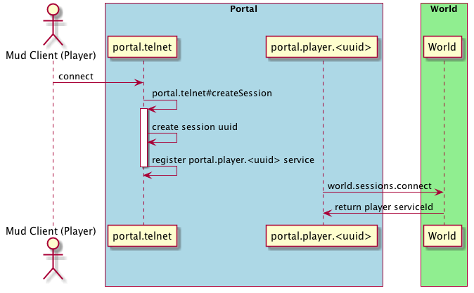

The Portal process handles the incoming connections from the player and proxies the player input to the [World](), and
the World input back to the Player. While it wont be typically necessary to alter how this process works, it may be
helpful to understand the Portal's architecture.

## Portal Architecture

The Portal is fairly simple, it is made up of the Broker (the Portal itself) and two 
[Services](http://moleculer.services/0.12/docs/service.html).

### TelnetService
The TelnetService is registered in the broker as `telnet`. It provides the socket server that the player clients connect
to.

### SessionService
The SessionService is spawned and registered by the  Portal service every time a player connects. A single 
SessionService service is spawned for every single player, and registered under `portal.sessions.<uuid>` where the 
`uuid` is a unique identifier for that connection created by the TelnetService at the time the connection event 
occurred.

The SessionService is responsible for passing all communication to the player client, and parsing incoming data from 
the client and passing it to the world.

## Connection Flow

1. As soon as the initial connection is made, a UUID is created to represent the connection.
1. The TelnetService then creates a new SessionService under the name of `portal.player.<uuid>`
1. The SessionService informs the World that a new connection has been made, after which the world creates a 
   corresponding endpoint for the SessionService to communicate with.
